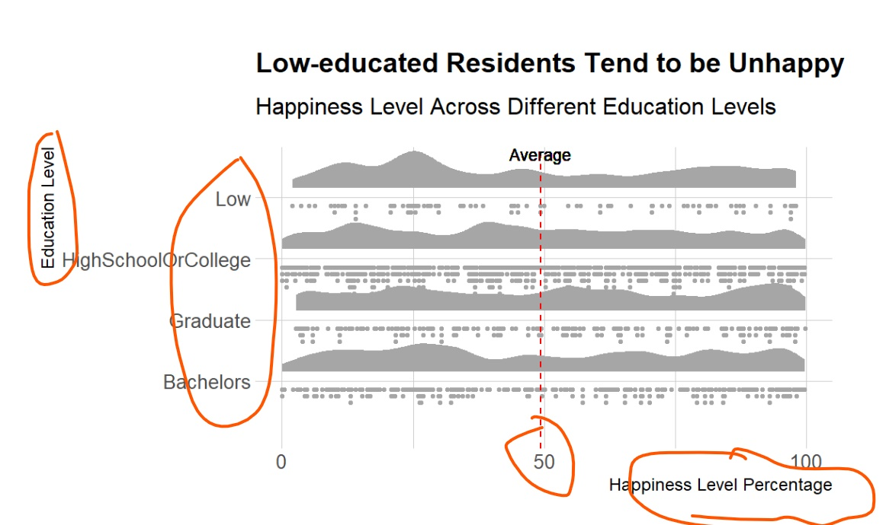

```{r setup, include=FALSE}
knitr::opts_chunk$set(echo = FALSE)
```


# Overview

In this take-home exercise, I have critiqued visual designs in terms of clarity and aesthetics, and remade the origial design by using data visualization principles and best practice in lesson 1 and lesson 2. 


```{r}
packages = c('tidyverse', 'ggridges', 'ggdist', 'hrbrthemes')

for (p in packages){
  if(!require(p, character.only = T)){
    install.packages(p) 
  }
  library(p, character.only = T)
}

```


```{r}
participants_data <- read_csv("data/Participants.csv")

```

# Graph 1 - Statistics on Residents who have kids

### Critics and Improvement Plan

The Graph is very clear on graph title, subtitle, axis titles, numbers. The use of different font sizes and bold features make the key message easier to be captured by readers. 


The following improvements are suggested to further enhance the clarity and aesthetics.
1. to change the location of y-axis tile so that it is easy to read
2. to rename the data label x-axis to "have kids", "no kids" 
3. to remove the x-axis title 
4. to add percentage to the data label
5. to move subtitle to below of the chart with caption
6. to narrow the width of the bar, the default is fat

### Graph 1 after Remaking

```{r}

p<- participants_data
p$haveKids <- as.character(p$haveKids)

p['haveKids'][p['haveKids'] == 'TRUE'] <- "Have kids"
p['haveKids'][p['haveKids'] == 'FALSE'] <- "Dont Have kids"


ggplot(data = p, 
       aes(x = haveKids)) +
  geom_bar(fill = "lightblue", width = 0.6)+
  labs(y = "No. of Residents",
       x = NULL,
       title = "Nearly 30% of Engagement Redisents Have Kids",
       caption = "A survey of 1011 Residents Taken in 2022")+
  
  geom_text(stat = "count",
            aes(label=paste0(..count.., ", ", round(..count../sum(..count..)*100, 1), "%")),
             vjust = -0.4, size = 4,
             position = position_dodge(width = 1))+
  ylim(0, 800)+
  theme()+
  theme(plot.caption= element_text(hjust = 0),
        panel.grid.major = element_blank(), 
        panel.grid.minor = element_blank(),
        panel.border = element_blank(), 
        panel.background = element_blank(),
        axis.line = element_line(colour = "black"),
        plot.title = element_text (hjust = 0.5))
  
```

# Graph 2 - Statistics on Age and Happiness

### Critics and Improvement Plan

Similar to Graph 1, Graph 2 is very clear on graph title, subtitle, axis titles, numbers.


The following improvements are suggested to further enhance the clarity and aesthetics.
1. to change the location of y-axis tile so that it is easy to read
2. to add a background with all the surveyed population so that it is more informative 
3. the conclusion that old people are unahppy is not so clear on the chart, boxplot is with mean value is better to show the results
4. to add jitter points to give a feel of sample size


### Graph 2 after Remaking


```{r}
participants_data <- participants_data %>%
  mutate(age_category=cut(age, 
                          breaks=c(17, 30, 40, 50, 60),
                          labels=c('30 and below','31-40','41-50','51 and above')))


ggplot(data = participants_data,
       aes(x = age_category, 
           y = joviality))+
  geom_boxplot()+
  geom_point(position = 'jitter',
             size = 0.5)+
  stat_summary(geom = "point",
               fun = "mean",
               color = "red",
               size=4
               )+
  labs(x = "Age Catergory",
       y = "Joviality",
       title = "Elder people Are Less Jovial")+
   theme(
        panel.grid.major = element_blank(), 
        panel.grid.minor = element_blank(),
        panel.border = element_blank(), 
        panel.background = element_blank(),
        axis.line = element_line(colour = "black"),
        plot.title = element_text (hjust = 0.5))
 
```

# Graph 3 - Statistics on Education and Happiness

### Critics and Improvement Plan

Similar to Graph 1 and 2, Graph 3 is very elegant, complex and clear on graph title, subtitle, axis titles, numbers.  



### Graph 3 after Remaking


The following improvements are suggested to further enhance the clarity and aesthetics.
1. to remove X label
2. to remove the average line as it doesn't support conclusion
3. to rename education level to easy understand 
4. to use halfeye and rank
4. to use ridge plot to uncover the relationship as a comparision


```{r}

p2<- participants_data
p2$educationLevel <- as.character(p2$educationLevel)

p2['educationLevel'][p2['educationLevel'] == 'Low'] <- "Low Education"
p2['educationLevel'][p2['educationLevel'] == 'HighSchoolOrCollege'] <- "High School or College"
```

```{r}
ggplot(data=p2, 
       aes(x =reorder(educationLevel, -joviality),
           y = joviality*100)) +
  scale_y_continuous(breaks = seq(0, 100, 50), 
                     limits = c(0, 100)) + 
  stat_halfeye(adjust = .4, 
               width = .8, 
               color = "black",
                position = position_nudge(
                 x = .01)) + 
  stat_dots(side = "left", 
            justification = 1.1,
            binwidth = .25,
            dotsize = 4) +

  xlab(NULL) +
  ylab("Happiness Level") +
  ggtitle("Graduates Tend to be Happier") +
  coord_flip()+
  theme(
        panel.grid.major = element_blank(), 
        panel.grid.minor = element_blank(),
        panel.border = element_blank(), 
        panel.background = element_blank(),
        axis.line = element_line(colour = "black"),
        plot.title = element_text (hjust = 0.5))
```


### Graph 3 - new proposal using stat_density_ridges

We can see that it is not easy to tell if education plays a role on joviality. statistical testing may be required to re-affirm. 

```{r}
ggplot(data = p2,
       aes(x = joviality, y = reorder( educationLevel, -joviality),
           fill = 0.5-abs(0.5-stat(ecdf)))) +
  stat_density_ridges(
    geom = "density_ridges_gradient",
    calc_ecdf = TRUE,
    rel_min_height = 0.01,
    scale = 0.95)+
  scale_fill_viridis_c(name = "Tail Probability",
                       direction = -1)+
  labs(x = "Joviality",
       y = NULL, 
       title = "Graduates Are slightly More Jovial")
```


